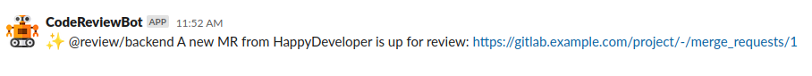
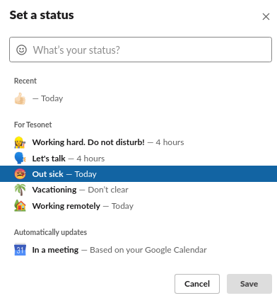

# Gitlab slack code review bot

[](https://www.paypal.com/donate?business=TRZXP9M47HZMJ&item_name=CodeReviewBot&currency_code=EUR)

## What's a code review bot?

When you create a merge request people are reluctant to review it as they feel someone else might do it later.

By tagging a special review group in your merge request a bot will determine which user is best suited to review your code and assign that user to your merge request. From this point on it is the sole duty of the reviewer to review your merge request.


You can also manually assign any number of developers by tagging them directly


The bot pings reviewers via slack to let them know there's a new merge request up for review.



Once the bot assigns you reviewers please refrain from asking other people to review your merge request unless absolutely necessary.

As soon as you get the needed number of approvals, the bot will inform you via slack


## Urgent merge requests
By convention, if a group contains the word `urgent` the bot assumes that the merge requests needs to be reviewed as fast as possible, e.g.

```
@review/backend/urgent
```

Your merge request will be assigned to a single reviewer to speed the process up. 

## Small merge requests
If your code changes are relatively small, you can use the group with the word `small` in it.

```
@review/backend/small
```

Your merge request will be assigned to a single reviewer since you only added minor changes.

## Ping the merge request author
If you added some comments to the merge requests, it sometimes makes sense to ping the author.

To do that, tag the reviewer directly

```
@HappyDeveloper Hey, I've added some things you might want to work on
```

## What if I get sick or go on a vacation?

Change your slack status to `:palm_tree:` or `:face_with_thermometer:` and the bot will not include you in the code review process



## How to setup

1. Create a `review` group with a `backend` subgroup.
You should be able to tag the group in MR comments as `@review/backend`
Add a few members to that group.

2. Create a dedicated gitlab user (e.g. CodeReviewBot) for code review messages. 
Add that user as owner to the parent group of the repositories.  

3. Clone the repository

4. Change .env values according to your own gitlab setup.
    1.  Generate a gitlab token from the user that will post comments as CodeReviewBot (GITLAB_TOKEN variable)
    1.  Create a slack app in your organization that has the permissions to find users by email and message them directly (SLACK_ACCESS_TOKEN variable)

5. Build and run the docker container.
Make sure the container is available externally so that your gitlab can make webhook requests into the container.
Fill the external url of the bot in the .env variable (DEFAULT_URI variable)

```
docker build -t bot .
docker run -it --name bot bot
```

6. Run the following command to sync all available members of the group

```
php bin/console app:author:sync
```

7. Run the following command to setup webhooks on all projects
```
php bin/console app:project:setup
```

8. Post a comment `@review/backend` and the bot will assign you a reviewer from the group
By default, `@review/backend/urgent` and `@review/backend/small` are available as well, so you can create these groups in gitlab.
If you create even more groups in gitlab (e.g. `@review/custom/developers`) you can easility
inform the bot about them using the `php bin/console app:scope:add` command

9. Create a gitlab cron job that sets all your users email as public
```sql
update users set public_email = email;
```
Alternatively, you can just ask the users to set their public email in their settings. 
This is needed because otherwise gitlab will send `redacted` in the webhook content
instead of the actual email of the user who commented on a merge request.

10. Enjoy the added responsibility of mandatory code review :)
